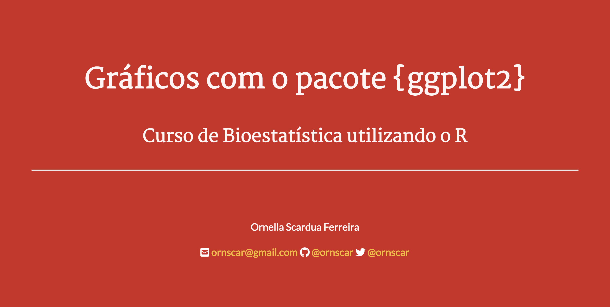

# Gráficos

Apresentação da aula **Tema 3 - Gráficos**, do _Curso de Bioestatística utilizando o R_, ofertada para o Programa de Pós-graduação em Saúde Coletiva da Faculdade de Medicina da USP (FMUSP).

