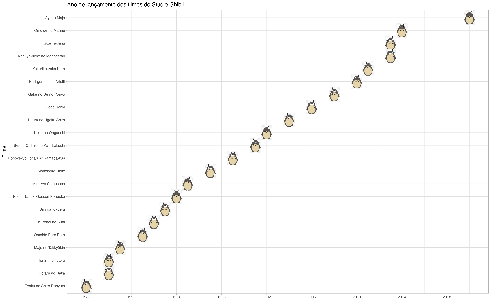

class: middle, center, inverse

# Gráficos com o pacote {ggplot2}

.large[### Curso de Bioestatística utilizando o R]

*****

#### <br><br><br>Ornella Scardua Ferreira
#### `r fontawesome::fa("square-envelope", fill = "#ffffff")` [ornscar@gmail.com](ornscar@gmail.com) `r fontawesome::fa("github", fill = "#ffffff")` [@ornscar](https://github.com/ornscar) `r fontawesome::fa("twitter", fill = "#ffffff")` [@ornscar](https://twitter.com/ornscar) 

```{r setup, include=FALSE}
options(htmltools.dir.version = FALSE)
```

```{r xaringan-themer, include=FALSE, warning=FALSE}
library(xaringanthemer)

red <- "#C0392B"
light_red <- "#FFF5F4"
gray <- "#333333"
dark_yellow <- "#EFBE43"

style_duo(
  # colors
  primary_color = light_red,
  secondary_color = red,
  header_color = gray,
  text_color = gray,
  code_inline_color = colorspace::lighten(gray),
  text_bold_color = colorspace::lighten(gray),
  link_color = dark_yellow,
  title_slide_text_color = dark_yellow,
  # fonts
  header_font_google = google_font("Martel", "300", "400"),
  text_font_google = google_font("Lato"),
  code_font_google = google_font("Fira Mono")
)
```

```{css, echo=FALSE}
li::marker {
  content: "⦿ ";
  color: #C0392B;
}

li li::marker {
  content: "• ";
}

li li li::marker {
  content: "⚬ ";
}

pre {
  max-height: 600px;
  overflow-y: auto;
  background-color: inherit;
}
```

---

### Cronograma

.pull-left[
#### **1. Introdução**

- O pacote `{ggplot2}`.

- Os dados:

    - Base 1: dados sobre gestantes diagnosticadas com diabetes gestacional.

    - Base 2: dados do Programa das Nações Unidas para o Desenvolvimento (PNUD).
    
#### <br>**3. Outras visualizações de dados**

- Apresentação de outros tipos de visualização de dados.

- <i><font color="red">Obs.: apenas para aguçar! Não iremos entrar em detalhes nos códigos</i></font> `r fontawesome::fa("face-frown", fill = "#333333")`
]

.pull-right[
#### **2. Aplicação no** `r fontawesome::fa("r-project", fill = "#333333")`

- Gráficos univariados:
    
    - Barras e histogramas.
    
- Gráficos bivariados:

    - Variáveis qualitativas x qualitativas: 
    
        - Barras agrupadas e empilhadas.
     
    - Variáveis quantitativas x quantitativas: 
    
        - Dispersão.

    - Variáveis qualitativas x quantitativas: 
    
       - Linhas, _boxplot_, violino, mapas de calor, halteres e barras de erros.
]

---
class: middle, center, inverse

## Introdução

---

### O pacote `{ggplot2}`

- Criado pelo estatístico neo-zelandês [Hadley Wickham](https://hadley.nz/).

- No livro **_A layered grammar of graphics_** (em português: _"Uma gramática em camadas dos gráficos"_), Hadley define que os elementos de um gráfico (dados, cores, formas geométricas, coordenadas, anotações etc) são camadas e que um gráfico é um conjunto de sobreposições de camadas.

- Vantagens:

    - MAIS bonitos;
    - MAIS intuitivos;
    - MAIS customizáveis;
    - sintaxe MAIS padronizada.
    
---

### Os dados

#### Base 1:

- A base de dados é sobre **gestantes diagnosticadas com diabetes gestacional** que realizaram o pré-natal entre os anos de 2012 a 2015 no Hospital das Clínicas da Universidade de São Paulo.

- Contém **408 observações** e **8 variáveis**, a saber:

> `ano`: ano em que a gestante realizou o pré-natal;

> `idade`: idade da gestante;

> `cor`: raça/cor da gestante;

> `n_gestacoes`: número de gestações anteriores;

> `imc_classe`: IMC categórico;

> `hb_glicada`: exame de hemoglobina glicada categórico;

> `glicemia_jejum`: valor do exame de glicemia de jejum (em mg/dL);

> `insulina`: se a gestante precisou usar insulina antes do parto.
    
---

- No `r fontawesome::fa("r-project", fill = "#333333")`:

```{r}
# carregando os dados

d_diab <- readr::read_csv("dados/diabetes.csv", show_col_types = FALSE)

# panorama da base de dados

dplyr::glimpse(d_diab)
```

---

#### Base 2:

- Base de dados do **PNUD** cujas informações socioeconômicas são dos anos de 2012 a 2021 a nível Brasil, Unidade Federativa (UF) e região metropolitana.
    
- Contém **490 observações** e **5 variáveis**, a saber:

> `ano`: ano de análise dos indicadores;

> `agregacao`: nível nacional, estadual e região metropolitana;

> `nome`: nome da UF e região metropolitana;

> `gini`: Índice de Gini;

> `espvida`: expectativa de vida, em anos.
    
---

- No `r fontawesome::fa("r-project", fill = "#333333")`:

```{r}
# carregando os dados

d_pnud <- readxl::read_xlsx("dados/pnud.xlsx")

# panorama da base de dados

dplyr::glimpse(d_pnud)
```

---
class: middle, center, inverse

## Aplicação no `r fontawesome::fa("r-project", fill = "white")`

---

### Gráfico univariados

#### Gráfico de barras

.pull-left[
```{r g1, paged.print=FALSE, eval=FALSE}
library(ggplot2)

ggplot(d_diab) #<<
``` 
] 

.pull-right[
```{r g1-out, ref.label="g1", out.width="90%", echo=FALSE, message=FALSE}
```
]

---

.pull-left[
```{r g2, paged.print=FALSE, eval=FALSE}
ggplot(d_diab, aes(x = imc_classe)) #<<
``` 
] 

.pull-right[
```{r g2-out, ref.label="g2", echo=FALSE, message=FALSE}
```
]

---

.pull-left[
```{r g3, paged.print=FALSE, eval=FALSE}
ggplot(d_diab, aes(x = imc_classe)) +
  geom_bar() #<<
``` 
] 

.pull-right[
```{r g3-out, ref.label="g3", echo=FALSE, message=FALSE}
```
]

---

.pull-left[
```{r g4, paged.print=FALSE, eval=FALSE}
ggplot(d_diab, aes(x = imc_classe, y = after_stat(count)/sum(after_stat(count)))) + #<<
  geom_bar()
``` 
] 

.pull-right[
```{r g4-out, ref.label="g4", echo=FALSE, message=FALSE}
```
]

---

.pull-left[
```{r g5, paged.print=FALSE, eval=FALSE}
ggplot(d_diab, aes(x = imc_classe, y = after_stat(count)/sum(after_stat(count)))) + 
  geom_bar(color = "blue", fill = "white") #<<
``` 
] 

.pull-right[
```{r g5-out, ref.label="g5", echo=FALSE, message=FALSE}
```
]

---

.pull-left[
```{r g6, paged.print=FALSE, eval=FALSE}
ggplot(d_diab, aes(x = imc_classe, y = after_stat(count)/sum(after_stat(count)))) +
  geom_bar(color = "blue", fill = "white") +
  scale_y_continuous(labels = scales::percent) #<<
``` 
] 

.pull-right[
```{r g6-out, ref.label="g6", echo=FALSE, message=FALSE}
```
]

---

.pull-left[
```{r g7, paged.print=FALSE, eval=FALSE}
ggplot(d_diab, aes(x = imc_classe, y = after_stat(count)/sum(after_stat(count)))) +
  geom_bar(color = "blue", fill = "white") +
  scale_y_continuous(labels = scales::percent) +
  geom_text( #<<
    stat = "count", #<<
    aes(label = round(after_stat(count)/sum(after_stat(count)), 1) * 100, #<<
    vjust = -1) #<<
  ) #<<
``` 
] 

.pull-right[
```{r g7-out, ref.label="g7", echo=FALSE, message=FALSE}
```
]

---

.pull-left[
```{r g8, paged.print=FALSE, eval=FALSE}
ggplot(d_diab, aes(x = imc_classe, y = after_stat(count)/sum(after_stat(count)))) +
  geom_bar(color = "blue", fill = "white") +
  scale_y_continuous(labels = scales::percent) +
  geom_text(
    stat = "count", 
    aes(label = round(after_stat(count)/sum(after_stat(count)), 1) * 100,
    vjust = -1)
  ) +
  labs( #<<
    title = "Frequência do IMC categórico das gestantes", #<<
       x = "IMC categórico", #<<    
       y = "Frequência" #<<
  ) #<<
``` 
] 

.pull-right[
```{r g8-out, ref.label="g8", echo=FALSE, message=FALSE}
```
]

---

#### Histograma

.pull-left[
```{r g9, paged.print=FALSE, eval=FALSE}
ggplot(d_diab) #<<
```
]

.pull-right[
```{r g9-out, ref.label="g9", echo=FALSE, message=FALSE}
```
]

---

.pull-left[
```{r g10, paged.print=FALSE, eval=FALSE}
ggplot(d_diab, aes(x = glicemia_jejum)) #<<
```
]

.pull-right[
```{r g10-out, ref.label="g10", echo=FALSE, message=FALSE}
```
]

---

.pull-left[
```{r g11, paged.print=FALSE, eval=FALSE}
ggplot(d_diab, aes(x = glicemia_jejum)) +
  geom_histogram() #<<
```
]

.pull-right[
```{r g11-out, ref.label="g11", echo=FALSE, message=FALSE}
```
]

---

.pull-left[
```{r g12, paged.print=FALSE, eval=FALSE}
ggplot(d_diab, aes(x = glicemia_jejum)) +
  geom_histogram(color = "white") #<<
```
]

.pull-right[
```{r g12-out, ref.label="g12", echo=FALSE, message=FALSE}
```
]

---

.pull-left[
```{r g13, paged.print=FALSE, eval=FALSE}
ggplot(d_diab, aes(x = glicemia_jejum)) +
  geom_histogram(color = "white", breaks = seq(90, 125, 5)) #<<
```
]

.pull-right[
```{r g13-out, ref.label="g13", echo=FALSE, message=FALSE}
```
]

---

.pull-left[
```{r g14, paged.print=FALSE, eval=FALSE}
ggplot(d_diab, aes(x = glicemia_jejum)) +
  geom_histogram(color = "white", breaks = seq(90, 125, 5)) +
  labs(title = "Frequência dos valores do exame de glicemia de jejum", #<<
       x = "Glicemia de jejum (em mg/dL)", #<<
       y = "Frequência") #<<
```
]

.pull-right[
```{r g14-out, ref.label="g14", echo=FALSE, message=FALSE}
```
]

---

.pull-left[
```{r g15, paged.print=FALSE, eval=FALSE}
ggplot(d_diab, aes(x = glicemia_jejum)) +
  geom_histogram(color = "white", breaks = seq(90, 125, 5)) +
  labs(title = "Frequência dos valores do exame de glicemia de jejum",
       x = "Glicemia de jejum (em mg/dL)",
       y = "Frequência") +
  theme_bw() #<<
``` 
] 

.pull-right[
```{r g15-out, ref.label="g15", echo=FALSE, message=FALSE}
```
]

---

### Gráficos bivariados (**qualitativas x qualitativas**)

#### Gráfico de barras agrupadas

.pull-left[
```{r g16, paged.print=FALSE, eval=FALSE}
d_diab |> 
  dplyr::filter(!is.na(cor)) |> 
  ggplot(aes(x = cor, fill = insulina)) #<<
``` 
] 

.pull-right[
```{r g16-out, ref.label="g16", out.width="85%", echo=FALSE, message=FALSE}
```
]

---

.pull-left[
```{r g17, paged.print=FALSE, eval=FALSE}
d_diab |> 
  dplyr::filter(!is.na(cor)) |> 
  ggplot(aes(x = cor, fill = insulina)) +
    geom_bar() #<<
``` 
] 

.pull-right[
```{r g17-out, ref.label="g17", echo=FALSE, message=FALSE}
```
]

---

.pull-left[
```{r g18, paged.print=FALSE, eval=FALSE}
d_diab |> 
  dplyr::filter(!is.na(cor)) |> 
  ggplot(aes(x = cor, fill = insulina)) +
    geom_bar(aes(y = after_stat(count)/sum(after_stat(count))), position = "dodge") #<<
``` 
] 

.pull-right[
```{r g18-out, ref.label="g18", echo=FALSE, message=FALSE}
```
]

---

.pull-left[
```{r g19, paged.print=FALSE, eval=FALSE}
d_diab |> 
  dplyr::filter(!is.na(cor)) |> 
  ggplot(aes(x = cor, fill = insulina)) +
    geom_bar(aes(y = after_stat(count)/sum(after_stat(count))), position = "dodge") +
    scale_y_continuous(labels = scales::percent) #<<
``` 
] 

.pull-right[
```{r g19-out, ref.label="g19", echo=FALSE, message=FALSE}
```
]

---

.pull-left[
```{r g20, paged.print=FALSE, eval=FALSE, message=FALSE}
d_diab |> 
  dplyr::filter(!is.na(cor)) |> 
  ggplot(aes(x = cor, fill = insulina)) +
    geom_bar(aes(y = after_stat(count)/sum(after_stat(count))), position = "dodge") +
    scale_y_continuous(labels = scales::percent) +
    labs( #<<
      x = "Raça/cor", #<<
      y = "Frequência", #<<
      fill = "Usou insulina?" #<<
    ) #<<
``` 
] 

.pull-right[
```{r g20-out, ref.label="g20", echo=FALSE, message=FALSE}
```
]

---

.pull-left[
```{r g21, paged.print=FALSE, eval=FALSE, message=FALSE}
d_diab |> 
  dplyr::filter(!is.na(cor)) |> 
  ggplot(aes(x = cor, fill = insulina)) +
    geom_bar(aes(y = after_stat(count)/sum(after_stat(count))), position = "dodge") +
    scale_y_continuous(labels = scales::percent) +
    labs(
      x = "Raça/cor",
      y = "Frequência",
      fill = "Usou insulina?"
    ) +
    theme_bw() #<<
``` 
] 

.pull-right[
```{r g21-out, ref.label="g21", echo=FALSE, message=FALSE}
```
]

---

#### Gráfico de barras empilhadas
    
.pull-left[
```{r g22, paged.print=FALSE, eval=FALSE, message=FALSE}
d_diab |> 
  dplyr::filter(!is.na(cor)) |> 
  ggplot(aes(x = cor, fill = insulina)) #<<
``` 
] 

.pull-right[
```{r g22-out, ref.label="g22", echo=FALSE, message=FALSE}
```
] 

---

.pull-left[
```{r g23, paged.print=FALSE, eval=FALSE, message=FALSE}
d_diab |> 
  dplyr::filter(!is.na(cor)) |> 
  ggplot(aes(x = cor, fill = insulina)) +
    geom_bar(position = "stack") #<<
``` 
] 

.pull-right[
```{r g23-out, ref.label="g23", echo=FALSE, message=FALSE}
```
] 

---

.pull-left[
```{r g24, paged.print=FALSE, eval=FALSE, message=FALSE}
d_diab |> 
  dplyr::filter(!is.na(cor)) |> 
  ggplot(aes(x = cor, fill = insulina)) +
    geom_bar(position = "fill") #<<
``` 
] 

.pull-right[
```{r g24-out, ref.label="g24", echo=FALSE, message=FALSE}
```
] 

---

.pull-left[
```{r g25, paged.print=FALSE, eval=FALSE, message=FALSE}
d_diab |> 
  dplyr::filter(!is.na(cor)) |> 
  ggplot(aes(x = cor, fill = insulina)) +
    geom_bar(position = "fill") +
    scale_y_continuous(labels = scales::percent) #<<
``` 
] 

.pull-right[
```{r g25-out, ref.label="g25", echo=FALSE, message=FALSE}
```
] 

---

.pull-left[
```{r g26, paged.print=FALSE, eval=FALSE, message=FALSE}
d_diab |> 
  dplyr::filter(!is.na(cor)) |> 
  ggplot(aes(x = cor, fill = insulina)) +
    geom_bar(position = "fill") +
    scale_y_continuous(labels = scales::percent) +
    labs( #<<
      x = "Raça/cor", #<<
      y = "Frequência", #<<
      fill = "Usou insulina?" #<<
    ) #<<
``` 
] 

.pull-right[
```{r g26-out, ref.label="g26", echo=FALSE, message=FALSE}
```
] 

---

.pull-left[
```{r g27, paged.print=FALSE, eval=FALSE, message=FALSE}
d_diab |> 
  dplyr::filter(!is.na(cor)) |> 
  ggplot(aes(x = cor, fill = insulina)) +
    geom_bar(position = "fill") +
    scale_y_continuous(labels = scales::percent) +
    labs( 
      x = "Raça/cor", 
      y = "Frequência", 
      fill = "Usou insulina?" 
    ) +
    scale_fill_brewer(palette = "Accent") #<<
``` 
] 

.pull-right[
```{r g27-out, ref.label="g27", echo=FALSE, message=FALSE}
```
]

<br><br>
.center[
<font size=3>Para ver outras paletas R Color Brewer, <a href="https://www.andrewheiss.com/blog/2023/07/25/conjoint-bayesian-frequentist-guide/">clique aqui</a>!</font>
]

---

.pull-left[
```{r g50, paged.print=FALSE, eval=FALSE, message=FALSE}
d_diab |> 
  dplyr::filter(!is.na(cor)) |> 
  ggplot(aes(x = cor, fill = insulina)) +
    geom_bar(position = "fill") +
    scale_y_continuous(labels = scales::percent) +
    labs( 
      x = "Raça/cor", 
      y = "Frequência", 
      fill = "Usou insulina?" 
    ) +
    scale_fill_brewer(palette = "Accent") -> g#<< 

g_diab <- g$data |> 
  dplyr::group_by(cor, insulina) |>
  dplyr::summarise(n = dplyr::n()) |> 
  dplyr::mutate(
    prop = n / sum(n), 
    rotulo = scales::percent(prop)
  )

g_diab |> 
  ggplot(aes(x = cor, y = prop, fill = insulina)) +
    geom_bar(stat = "identity", position = "fill") + #<<
    scale_y_continuous(labels = scales::percent) +
    labs( 
      x = "Raça/cor", 
      y = "Frequência", 
      fill = "Usou insulina?" 
    ) +
    scale_fill_brewer(palette = "Accent") +
    geom_text( #<<
      aes(label = rotulo), size = 3, #<<
      position = position_stack(vjust = .5) #<<
    ) #<<
``` 
] 

.pull-right[
```{r g50-out, ref.label="g50", echo=FALSE, message=FALSE}
```
] 

---

### Gráficos bivariados (**quantitativas x quantitativas**)

#### Gráfico de dispersão
    
.pull-left[
```{r g28, paged.print=FALSE, eval=FALSE}
ggplot(d_diab) #<<
``` 
] 

.pull-right[
```{r g28-out, ref.label="g28", out.width="90%", echo=FALSE, message=FALSE}
```
]

---

.pull-left[
```{r g29, paged.print=FALSE, eval=FALSE}
ggplot(d_diab, aes(x = idade, y = glicemia_jejum)) #<<
``` 
] 

.pull-right[
```{r g29-out, ref.label="g29", echo=FALSE, message=FALSE}
```
]

---

.pull-left[
```{r g30, paged.print=FALSE, eval=FALSE}
ggplot(d_diab, aes(x = idade, y = glicemia_jejum)) +
  geom_point() #<<
``` 
] 

.pull-right[
```{r g30-out, ref.label="g30", echo=FALSE, message=FALSE}
```
]

---

.pull-left[
```{r g31, paged.print=FALSE, eval=FALSE}
ggplot(d_diab, aes(x = idade, y = glicemia_jejum)) +
  geom_point(size = 2, alpha = .5) #<<
``` 
] 

.pull-right[
```{r g31-out, ref.label="g31", echo=FALSE, message=FALSE}
```
]

---

.pull-left[
```{r g32, paged.print=FALSE, eval=FALSE}
ggplot(d_diab, aes(x = idade, y = glicemia_jejum)) +
  geom_point(size = 2, alpha = .5) +
  ggpubr::stat_cor( #<<
    aes(label = after_stat(r.label)), method = "pearson", #<<
    label.x = 40, label.y = 120, size = 4.5, color = "red" #<<
  ) #<<
``` 
] 

.pull-right[
```{r g32-out, ref.label="g32", echo=FALSE, message=FALSE}
```
]

---

.pull-left[
```{r g33, paged.print=FALSE, eval=FALSE}
ggplot(d_diab, aes(x = idade, y = glicemia_jejum)) +
  geom_point(size = 2, alpha = .5) +
  ggpubr::stat_cor( 
    aes(label = after_stat(r.label)), method = "pearson",
    label.x = 40, label.y = 120, size = 4.5, color = "red" 
  ) +
  labs( #<<
    x = "Idade (em anos)", #<<
    y = "Valor do exame de glicemia de jejum (em mg/dL)" #<<
  ) #<<
``` 
] 

.pull-right[
```{r g33-out, ref.label="g33", echo=FALSE, message=FALSE}
```
]

---

### Gráficos bivariados (**qualitativas x quantitativas**)

#### Gráfico de linhas

.pull-left[
```{r g34, paged.print=FALSE, eval=FALSE}
d_pnud |> 
  dplyr::group_by(ano, agregacao) |> 
  dplyr::summarise(media_espvida = mean(espvida)) |> 
  ggplot(aes(x = ano, y = media_espvida, color = agregacao)) #<<
``` 
] 

.pull-right[
```{r g34-out, ref.label="g34", out.width="90%", echo=FALSE, message=FALSE}
```
]

---

.pull-left[
```{r g35, paged.print=FALSE, eval=FALSE}
d_pnud |> 
  dplyr::group_by(ano, agregacao) |> 
  dplyr::summarise(media_espvida = mean(espvida)) |> 
  ggplot(aes(x = ano, y = media_espvida, color = agregacao)) +
    geom_line() #<<
``` 
] 

.pull-right[
```{r g35-out, ref.label="g35", echo=FALSE, message=FALSE}
```
]

---

.pull-left[
```{r g36, paged.print=FALSE, eval=FALSE}
d_pnud |> 
  dplyr::group_by(ano, agregacao) |> 
  dplyr::summarise(media_espvida = mean(espvida)) |> 
  ggplot(aes(x = ano, y = media_espvida, color = agregacao)) +
    geom_line() +
    geom_point() #<<
``` 
] 

.pull-right[
```{r g36-out, ref.label="g36", echo=FALSE, message=FALSE}
```
]

---

.pull-left[
```{r g37, paged.print=FALSE, eval=FALSE}
d_pnud |> 
  dplyr::group_by(ano, agregacao) |> 
  dplyr::summarise(media_espvida = mean(espvida)) |> 
  ggplot(aes(x = ano, y = media_espvida, color = agregacao)) +
    geom_line() +
    geom_point() +
    scale_x_continuous(breaks = seq(2012, 2021, 1)) #<<
``` 
] 

.pull-right[
```{r g37-out, ref.label="g37", echo=FALSE, message=FALSE}
```
]

---

.pull-left[
```{r g38, paged.print=FALSE, eval=FALSE}
d_pnud |> 
  dplyr::group_by(ano, agregacao) |> 
  dplyr::summarise(media_espvida = mean(espvida)) |> 
  ggplot(aes(x = ano, y = media_espvida, color = agregacao)) +
    geom_line() +
    geom_point() +
    scale_x_continuous(breaks = seq(2012, 2021, 1)) +
    theme_bw() #<<
``` 
] 

.pull-right[
```{r g38-out, ref.label="g38", echo=FALSE, message=FALSE}
```
]

---

.pull-left[
```{r g39, paged.print=FALSE, eval=FALSE}
d_pnud |> 
  dplyr::group_by(ano, agregacao) |> 
  dplyr::summarise(media_espvida = mean(espvida)) |> 
  ggplot(aes(x = ano, y = media_espvida, color = agregacao)) +
    geom_line() +
    geom_point() +
    scale_x_continuous(breaks = seq(2012, 2021, 1)) +
    theme_bw() +
    labs( #<<
      x = "Ano", #<<
      y = "Expectativa de vida média (em anos)", #<<
      fill = "Agregação" #<<
    ) #<<
``` 
] 

.pull-right[
```{r g39-out, ref.label="g39", echo=FALSE, message=FALSE}
```
]

---

.pull-left[
```{r g40, paged.print=FALSE, eval=FALSE}
d_pnud |> 
  dplyr::group_by(ano, agregacao) |> 
  dplyr::summarise(media_espvida = mean(espvida)) |> 
  ggplot(aes(x = ano, y = media_espvida, color = agregacao)) +
    geom_line() +
    geom_point() +
    scale_x_continuous(breaks = seq(2012, 2021, 1)) +
    theme_bw() +
    labs(
      x = "Ano",
      y = "Expectativa de vida média (em anos)",
      color = "Agregação"
    ) +
    theme(legend.position = "bottom") #<<
``` 
] 

.pull-right[
```{r g40-out, ref.label="g40", echo=FALSE, message=FALSE}
```
]

---

#### Boxplot e violino
    
.pull-left[
```{r g41, paged.print=FALSE, eval=FALSE}
ggplot(d_diab)
``` 
] 

.pull-right[
```{r g41-out, ref.label="g41", echo=FALSE, message=FALSE}
```
]

---

.pull-left[
```{r g42, paged.print=FALSE, eval=FALSE}
ggplot(d_diab, aes(x = hb_glicada, y = glicemia_jejum)) #<<
``` 
] 

.pull-right[
```{r g42-out, ref.label="g42", echo=FALSE, message=FALSE}
```
]

---

.pull-left[
```{r g43, paged.print=FALSE, eval=FALSE}
ggplot(d_diab, aes(x = hb_glicada, y = glicemia_jejum)) + 
  geom_boxplot() #<<
``` 
] 

.pull-right[
```{r g43-out, ref.label="g43", echo=FALSE, message=FALSE}
```
]

---

.pull-left[
```{r g44, paged.print=FALSE, eval=FALSE}
ggplot(d_diab, aes(x = hb_glicada, y = glicemia_jejum)) +
  geom_boxplot() + 
  geom_violin(fill = "#add8e6") #<<
``` 
] 

.pull-right[
```{r g44-out, ref.label="g44", echo=FALSE, message=FALSE}
```
]

---

.pull-left[
```{r g45, paged.print=FALSE, eval=FALSE}
ggplot(d_diab, aes(x = hb_glicada, y = glicemia_jejum)) +
  geom_violin(fill = "#add8e6") + #<<
  geom_boxplot() #<<
``` 
] 

.pull-right[
```{r g45-out, ref.label="g45", echo=FALSE, message=FALSE}
```
]

---

.pull-left[
```{r g51, paged.print=FALSE, eval=FALSE}
ggplot(d_diab, aes(x = hb_glicada, y = glicemia_jejum)) +
  geom_violin(fill = "#add8e6") + #<<
  geom_boxplot(width = .2) #<<
``` 
] 

.pull-right[
```{r g51-out, ref.label="g51", echo=FALSE, message=FALSE}
```
]

---

.pull-left[
```{r g46, paged.print=FALSE, eval=FALSE}
ggplot(d_diab, aes(x = hb_glicada, y = glicemia_jejum)) + 
  geom_violin(fill = "#add8e6") +
  geom_boxplot(width = .2) +
  labs( #<<
    x = "Hemoglobina glicada categórica", #<<
    y = "Valor do exame de glicemia de jejum (em mg/dL)", #<<
    fill = "Usou insulina?" #<<
  ) #<<
``` 
] 

.pull-right[
```{r g46-out, ref.label="g46", echo=FALSE, message=FALSE}
```
]

---

.pull-left[
```{r g47, paged.print=FALSE, eval=FALSE}
ggplot(d_diab, aes(x = hb_glicada, y = glicemia_jejum)) + 
  geom_violin(fill = "#add8e6") +
  geom_boxplot(width = .2) +
  labs(
    x = "Hemoglobina glicada categórica",
    y = "Valor do exame de glicemia de jejum (em mg/dL)", 
    fill = "Usou insulina?"
  ) +
  theme_classic() #<<
``` 
] 

.pull-right[
```{r g47-out, ref.label="g47", echo=FALSE, message=FALSE}
```
]

---

.pull-left[
```{r g48, paged.print=FALSE, eval=FALSE}
ggplot(d_diab, aes(x = hb_glicada, y = glicemia_jejum)) + 
  geom_violin(fill = "#add8e6") +
  geom_boxplot(width = .2) +
  labs(
    x = "Hemoglobina glicada categórica",
    y = "Valor do exame de glicemia de jejum (em mg/dL)", 
    fill = "Usou insulina?"
  ) +
  theme_classic() +
  facet_wrap(. ~ insulina) #<<
``` 
] 

.pull-right[
```{r g48-out, ref.label="g48", echo=FALSE, message=FALSE}
```
]

---

#### Mapa de calor

.pull-left[
```{r g49, paged.print=FALSE, eval=FALSE}
d_pnud |> 
  dplyr::filter(agregacao == "UF") |> 
  ggplot(aes(x = ano, y = nome, fill = gini)) #<<
``` 
] 

.pull-right[
```{r g49-out, ref.label="g49", echo=FALSE, message=FALSE}
```
]

---

.pull-left[
```{r g52, paged.print=FALSE, eval=FALSE}
d_pnud |> 
  dplyr::filter(agregacao == "UF") |> 
  ggplot(aes(x = ano, y = nome, fill = gini)) +
    geom_tile() #<<
``` 
] 

.pull-right[
```{r g52-out, ref.label="g52", echo=FALSE, message=FALSE}
```
]

---

.pull-left[
```{r g53, paged.print=FALSE, eval=FALSE}
d_pnud |> 
  dplyr::filter(agregacao == "UF") |> 
  ggplot(aes(x = ano, y = nome, fill = gini)) +
    geom_tile() +
    scale_fill_viridis_c() #<<
``` 
] 

.pull-right[
```{r g53-out, ref.label="g53", echo=FALSE, message=FALSE}
```
]

---

.pull-left[
```{r g54, paged.print=FALSE, eval=FALSE}
d_pnud |> 
  dplyr::filter(agregacao == "UF") |> 
  ggplot(aes(x = ano, y = nome, fill = gini)) +
    geom_tile() +
    scale_fill_viridis_c() +
    theme_bw() #<<
``` 
] 

.pull-right[
```{r g54-out, ref.label="g54", echo=FALSE, message=FALSE}
```
]

---

.pull-left[
```{r g67, paged.print=FALSE, eval=FALSE}
d_pnud |> 
  dplyr::filter(agregacao == "UF") |> 
  ggplot(aes(x = ano, y = nome, fill = gini)) +
    geom_tile() +
    scale_fill_viridis_c() +
    theme_bw() +
    scale_x_continuous(breaks = seq(2012, 2021, 1), expand = c(0, 0)) #<<
``` 
] 

.pull-right[
```{r g67-out, ref.label="g67", echo=FALSE, message=FALSE}
```
]

---

.pull-left[
```{r g55, paged.print=FALSE, eval=FALSE}
d_pnud |> 
  dplyr::filter(agregacao == "UF") |> 
  ggplot(aes(x = ano, y = nome, fill = gini)) +
    geom_tile() +
    scale_fill_viridis_c() +
    theme_bw() +
    scale_x_continuous(breaks = seq(2012, 2021, 1), expand = c(0, 0)) +
    labs( #<<
      x = "Ano", #<<
      y = "Unidade Federativa (UF)", #<<
      fill = "Índice \nde Gini" #<<
    ) #<<
``` 
] 

.pull-right[
```{r g55-out, ref.label="g55", echo=FALSE, message=FALSE}
```
]

---

.pull-left[
```{r g68, paged.print=FALSE, eval=FALSE}
d_pnud |> 
  dplyr::filter(agregacao == "UF") |> 
  ggplot(aes(x = ano, y = nome, fill = gini)) +
    geom_tile() +
    scale_fill_viridis_c() +
    theme_bw() +
    scale_x_continuous(breaks = seq(2012, 2021, 1), expand = c(0, 0)) +
    labs(
      x = "Ano", 
      y = "Unidade Federativa (UF)", 
      fill = "Índice \nde Gini"
    ) +
    theme( #<<
      legend.position = "bottom", #<<
      legend.key.width = unit(1.5, 'cm') #<<
    ) #<<
``` 
] 

.pull-right[
```{r g68-out, ref.label="g68", echo=FALSE, message=FALSE}
```
]

---

#### Gráfico de halteres (ou de _dumbell_)

.pull-left[
```{r g56, paged.print=FALSE, eval=FALSE}
d_pnud |> 
  dplyr::filter(agregacao == "UF" & ano %in% c(2011, 2021)) |> 
  ggplot(aes(x = espvida, y = nome)) #<<
``` 
] 

.pull-right[
```{r g56-out, ref.label="g56", echo=FALSE, message=FALSE}
```
]

---

.pull-left[
```{r g57, paged.print=FALSE, eval=FALSE}
d_pnud |> 
  dplyr::filter(agregacao == "UF" & ano %in% c(2012, 2019)) |> 
  ggplot(aes(x = espvida, y = nome)) +
    geom_point(aes(color = factor(ano))) + #<<
    geom_line(aes(group = nome)) #<<
``` 
] 

.pull-right[
```{r g57-out, ref.label="g57", echo=FALSE, message=FALSE}
```
]

---

.pull-left[
```{r g58, paged.print=FALSE, eval=FALSE}
d_pnud |> 
  dplyr::filter(agregacao == "UF" & ano %in% c(2012, 2019)) |> 
  ggplot(aes(x = espvida, y = reorder(nome, espvida, max))) + #<<
    geom_point(aes(color = factor(ano))) + 
    geom_line(aes(group = nome)) 
``` 
] 

.pull-right[
```{r g58-out, ref.label="g58", echo=FALSE, message=FALSE}
```
]

---

.pull-left[
```{r g59, paged.print=FALSE, eval=FALSE}
d_pnud |> 
  dplyr::filter(agregacao == "UF" & ano %in% c(2012, 2019)) |> 
  ggplot(aes(x = espvida, y = reorder(nome, espvida, max))) + 
    geom_point(aes(color = factor(ano))) + 
    geom_line(aes(group = nome)) +
    labs( #<<
      title = "Expectativa de vida do brasileiro, por UF", #<<
      subtitle = "Entre os anos de 2012 a 2019", #<<
      x = "Expectativa de vida (em anos)", #<<
      y = "Unidade Federativa (UF)" #<<
    ) #<<
``` 
] 

.pull-right[
```{r g59-out, ref.label="g59", echo=FALSE, message=FALSE}
```
]

---

.pull-left[
```{r g60, paged.print=FALSE, eval=FALSE}
d_pnud |> 
  dplyr::filter(agregacao == "UF" & ano %in% c(2012, 2019)) |> 
  ggplot(aes(x = espvida, y = reorder(nome, espvida, max))) + 
    geom_point(aes(color = factor(ano))) + 
    geom_line(aes(group = nome)) +
    labs( 
      title = "Expectativa de vida do brasileiro, por UF", 
      subtitle = "Entre os anos de 2012 a 2019", 
      x = "Expectativa de vida (em anos)", 
      y = "Unidade Federativa (UF)", 
      fill = "Ano"
    ) +
   theme_minimal() #<<
``` 
] 

.pull-right[
```{r g60-out, ref.label="g60", echo=FALSE, message=FALSE}
```
]

---

#### Gráfico de médias com barras de erros ( _errorbar_)

.pull-left[
```{r g61, paged.print=FALSE, eval=FALSE}
d_diab |> 
  dplyr::group_by(imc_classe) |> 
  dplyr::summarise(
    n = dplyr::n(),
    media = mean(glicemia_jejum),
    desvio = sd(glicemia_jejum),
    erro.padrao = desvio / sqrt(n)
  ) |> 
  ggplot(aes(x = imc_classe, y = media)) #<<
``` 
] 

.pull-right[
```{r g61-out, ref.label="g61", echo=FALSE, message=FALSE}
```
]

---

.pull-left[
```{r g62, paged.print=FALSE, eval=FALSE}
d_diab |> 
  dplyr::group_by(imc_classe) |> 
  dplyr::summarise(
    n = dplyr::n(),
    media = mean(glicemia_jejum),
    desvio = sd(glicemia_jejum),
    erro.padrao = desvio / sqrt(n)
  ) |> 
  ggplot(aes(x = imc_classe, y = media)) +
    geom_point(size = 3) #<<
``` 
] 

.pull-right[
```{r g62-out, ref.label="g62", echo=FALSE, message=FALSE}
```
]

---

.pull-left[
```{r g63, paged.print=FALSE, eval=FALSE}
d_diab |> 
  dplyr::group_by(imc_classe) |> 
  dplyr::summarise(
    n = dplyr::n(),
    media = mean(glicemia_jejum),
    desvio = sd(glicemia_jejum),
    erro.padrao = desvio / sqrt(n)
  ) |> 
  ggplot(aes(x = imc_classe, y = media)) +
    geom_point(size = 3) +
    geom_errorbar( #<<
      aes(ymin = media - erro.padrao, #<<
          ymax = media + erro.padrao), #<<
      width = .1 #<<
  ) #<<
``` 
] 

.pull-right[
```{r g63-out, ref.label="g63", echo=FALSE, message=FALSE}
```
]

---

.pull-left[
```{r g64, paged.print=FALSE, eval=FALSE}
d_diab |> 
  dplyr::group_by(imc_classe, insulina) |> 
  dplyr::summarise(
    n = dplyr::n(),
    media = mean(glicemia_jejum),
    desvio = sd(glicemia_jejum),
    erro.padrao = desvio / sqrt(n)
  ) |> 
  ggplot(aes(x = imc_classe, y = media, group = insulina, color = insulina)) + #<<
    geom_point(size = 3) +
    geom_errorbar( 
      aes(ymin = media - erro.padrao, 
          ymax = media + erro.padrao), 
      width = .1 
  ) 
``` 
] 

.pull-right[
```{r g64-out, ref.label="g64", echo=FALSE, message=FALSE}
```
]

---

.pull-left[
```{r g65, paged.print=FALSE, eval=FALSE}
d_diab |> 
  dplyr::group_by(imc_classe, insulina) |> 
  dplyr::summarise(
    n = dplyr::n(),
    media = mean(glicemia_jejum),
    desvio = sd(glicemia_jejum),
    erro.padrao = desvio / sqrt(n)
  ) |> 
  ggplot(aes(x = imc_classe, y = media, group = insulina, color = insulina)) + 
    geom_point(size = 3) +
    geom_errorbar( 
      aes(ymin = media - erro.padrao, 
          ymax = media + erro.padrao), 
      width = .1 
  ) +
  labs( #<<
    x = "IMC categórico", #<<
    y = "Média do valor do exame de glicemia de jejum (em mg/dL)", #<<
    color = "Usou insulina?" #<<
  ) #<<
``` 
] 

.pull-right[
```{r g65-out, ref.label="g65", echo=FALSE, message=FALSE}
```
]

---

.pull-left[
```{r g66, paged.print=FALSE, eval=FALSE}
d_diab |> 
  dplyr::group_by(imc_classe, insulina) |> 
  dplyr::summarise(
    n = dplyr::n(),
    media = mean(glicemia_jejum),
    desvio = sd(glicemia_jejum),
    erro.padrao = desvio / sqrt(n)
  ) |> 
  ggplot(aes(x = imc_classe, y = media, group = insulina, color = insulina)) + 
    geom_point(size = 3) +
    geom_errorbar( 
      aes(ymin = media - erro.padrao, 
          ymax = media + erro.padrao), 
      width = .1 
  ) +
  labs( 
    x = "IMC categórico", 
    y = "Média do valor do exame de glicemia de jejum (em mg/dL)", 
    fill = "Usou insulina?" 
  ) +
  theme_bw() #<<
``` 
] 

.pull-right[
```{r g66-out, ref.label="g66", echo=FALSE, message=FALSE}
```
]

---
class: middle, center, inverse

## Salvando um gráfico no `r fontawesome::fa("r-project", fill = "#333333")`...

---

### Gostaríamos de salvar os gráficos univariados...

- Precisamos atribuí-los a objetos:

```{r}
g1 <- ggplot(d_diab, aes(x = imc_classe, y = after_stat(count)/sum(after_stat(count)))) +
  geom_bar(color = "blue", fill = "white") +
  scale_y_continuous(labels = scales::percent) +
  geom_text(stat = "count", 
            aes(label = round(after_stat(count)/sum(after_stat(count)), 1) * 100, 
                vjust = -1)) +
  labs(title = "Frequência do IMC categórico das gestantes",
       x = "IMC categórico", y = "Frequência")

g2 <- ggplot(d_diab, aes(x = glicemia_jejum)) +
  geom_histogram(color = "white", breaks = seq(90, 125, 5)) +
  labs(title = "Frequência dos valores do exame de glicemia de jejum",
       x = "Glicemia de jejum (em mg/dL)", y = "Frequência") +
  theme_bw() 
```

- Além disso, podemos salvá-los em uma única imagem. Fazemos isso com o pacote `{patchwork}`.

```{r}
library(patchwork)
```


---

.pull-left[
- Para o caso de dispor os gráficos um embaixo do outro, usa-se barra:

```{r}
g1 / g2
```
]

.pull-right[
- Já para o caso em que os gráficos fiquem lado a lado, usa-se sinal de adição ou barra vertical:
 
```{r}
g1 + g2
```   
]

---

- Agora sim, vamos salvar os gráficos!

    - Fazemos isso com a função `ggsave( )`:

```{r}
ggsave("graficos/univariados.png", width = 16, height = 10)
```

- <font color="red">Importante!</font> A função `ggsave( )` salva o último gráfico que foi rodado em seu editor ou console.

- É possível salvar em vários formatos, como TEX, PDF, JPEG, TIFF, PNG e SVG.

- Por padrão, a imagem tem resolução 300dpi (alta resolução).

---
class: middle, center, inverse

## Outras representações gráficas

#### No R, é possível fazer...

---
class: middle

### ... gráfico animado;

```{r echo=FALSE, fig.align ='center', out.width="65%", fig.cap='Figura 1: Gráfico animado do ano de lançamento dos filmes do Studio Ghibli.'}

```

---
class: middle

### ... gráfico de densidades;

```{r echo=FALSE, fig.align ='center', out.width="50%", fig.cap='Figura 2: Gráfico das distribuições de densidade da temperatura, por mês do ano de 2016, na cidade de Lincoln, em Nebraska/EUA.'}

```

.center[
<font size=3>Fonte: <a href="https://www.datanovia.com/en/blog/elegant-visualization-of-density-distribution-in-r-using-ridgeline/">Datanovia | Elegant Visualization of Density Distribution in R Using Ridgeline</a></font>.
]

---
class: middle

### ... nuvem de palavras;

```{r echo=FALSE, fig.align ='center', out.width="80%", fig.cap='Figura 3: Nuvem de palavras das músicas da Mukeka di Rato.'}
knitr::include_graphics("img/nuvem.png")
```

---
class: middle

### ... gráfico de florestas ( _forest plot_);

```{r echo=FALSE, fig.align ='center', out.width="28%", fig.cap='Figura 4: Gráfico de floresta dos efeitos marginais médios entre candidatos, segundo condições sociodemográficas.'}
knitr::include_graphics("img/forest.png")
```

.center[
<font size=3>Fonte: <a href="https://www.andrewheiss.com/blog/2023/07/25/conjoint-bayesian-frequentist-guide/">Andrew Heiss | The ultimate practical guide to conjoint analysis with R</a></font>.
]

---
class: middle

### ... arte;

```{r echo=FALSE, fig.align ='center', out.width="85%", fig.cap='Figura 5: Arte com R por Danielle Navarro (à direita) e Thomas Lin Pedersen (à esquerda).'}
knitr::include_graphics("img/arte.jpg")
```

<br><br>
.center[
<font size=3>Fonte: <a href="https://art.djnavarro.net/#pid=23">Art by Danielle Navarro</a> e <a href="https://www.data-imaginist.com/art">Data Imaginist - Visualization and beyond…</a></font>.
]

---
class: middle, center

### ... e muito mais!

---
class: middle, center, inverse

## Indicações

---

.pull-left[
### Fóruns

- [Stack Overflow](https://stackoverflow.com)!!!;

- [Discourse da Curso-R](https://livro.curso-r.com/8-1-o-pacote-ggplot2.html).

### Livros _on-line_

- [Ciência de Dados em R](https://livro.curso-r.com);

- [R for data Science](https://r4ds.had.co.nz/data-visualisation.html);

- [Modern Data Visualization with R](https://rkabacoff.github.io/datavis/);

- [ggplot2: Elegant Graphics for Data Analysis](https://ggplot2-book.org/maps).
]

.pull-right[
### Sites

- [The R Graph Gallery](https://r-graph-gallery.com);

- [R Charts](https://r-charts.com).

### Posts

- [_Incrementando seus gráficos do ggplot2_](https://daslab-ufes.github.io/ggplot2_misc/);

- [_Como criar gráficos interativos no R_](https://daslab-ufes.github.io/highcharter/);

- [_Be Awesome in ggplot2: A Practical Guide to be Highly Effective - R software and data visualization_](http://www.sthda.com/english/wiki/be-awesome-in-ggplot2-a-practical-guide-to-be-highly-effective-r-software-and-data-visualization).
]

<br><br>
.center[
<font size=5>No mais: use o Google sem dó!</font>
]

---
class: middle, center, inverse

# Meu obrigada!
# `r fontawesome::fa("heart", fill = "#333333")`


slides criados via pacote R:

[**xaringan**](https://github.com/yihui/xaringan)<br>
[gadenbuie/xaringanthemer](https://github.com/gadenbuie/xaringanthemer)

o chakra vem de [remark.js](https://remarkjs.com), [**knitr**](http://yihui.name/knitr) e [R Markdown](https://rmarkdown.rstudio.com).


